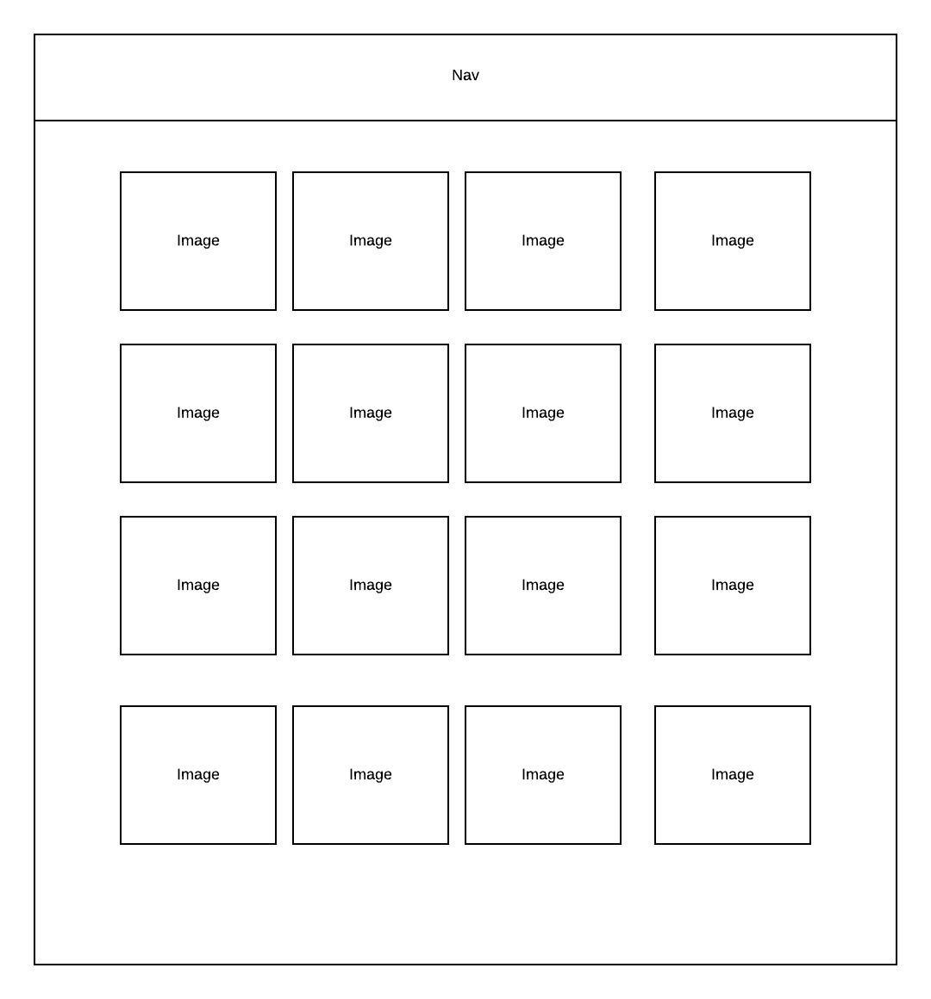
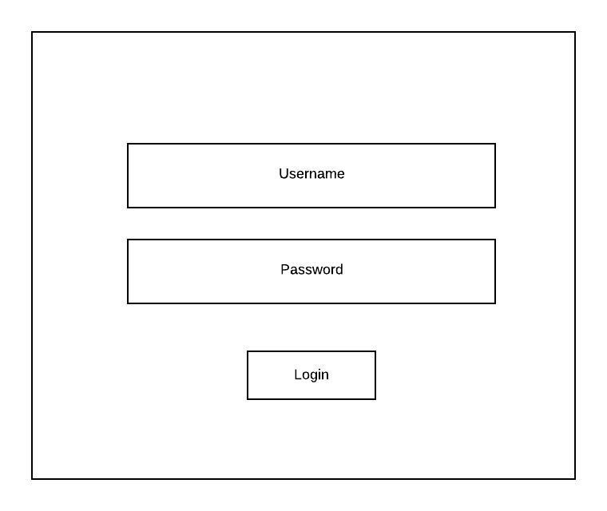
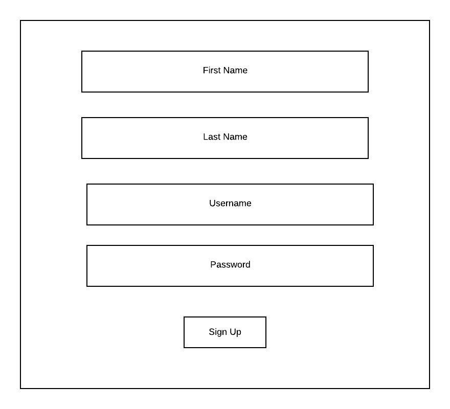
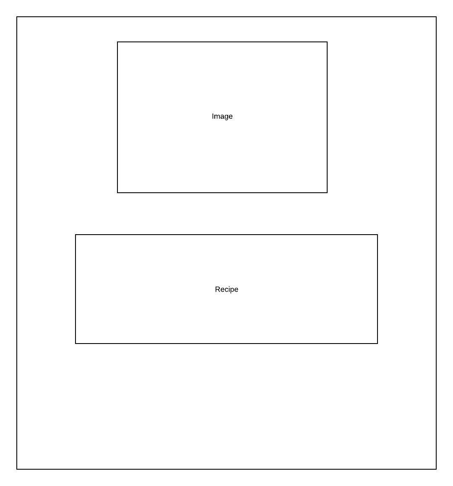
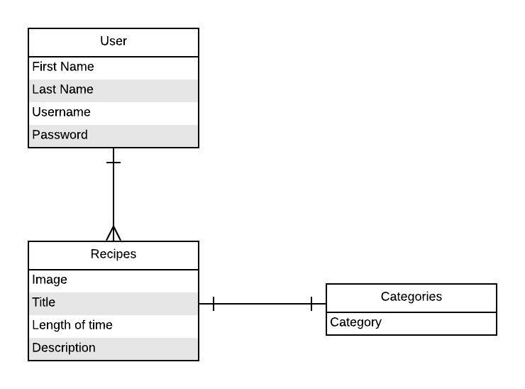

# project4

Title: **Lettuce Eat!** 

### Overview
Lettuce eat! is a site that will users to post images of food and their recipe on how to make the dish. 


### MVP Goals
- _Login Form_
- _Register Form_
- _Create Post_
- _Edit Post_
- _Delete Post CTA_


#### Libraries

|     Library      | Description                                |
| :--------------: | :----------------------------------------- |
|      React       | _React is a declarative, efficient, and flexible JavaScript library for building user interfaces._ |
|   React Router   | _React Router is the standard routing library for React._ |
|     Rails     | _ |

### MVP Server (Back End)

- - _Users table will contains username/password with proper bcrypt authentication_
- _Posts table will contains image of dish_
- _Recipe table will contain full namee of dish, description of how to make the dish, and ingredients_

#### Wireframes









#### ERD Model



#### Data Heirarchy

``` structure

database_db
|__ Users/
|__ Posts/
|__ Recipe/

```


#### Component Hierarchy

``` structure

src
|__ assets/
      |__ images
|__ components/
      |__ Header.js
      |__ Footer.js
      |__ posts.js
      |__ recipe.js
      |__ profile.js
      |__ login.js
      |__ register.js
      |__ gallery.js


```
### Post-MVP

#### Post-MVP Goals

_ _Users will be able to rate dishes_
- _Users will be able to fav dishes_
_ _User will be able to filter dishes by rating and length of time_
- _Users will be ablt to add friends and have them show up on their profile page_


